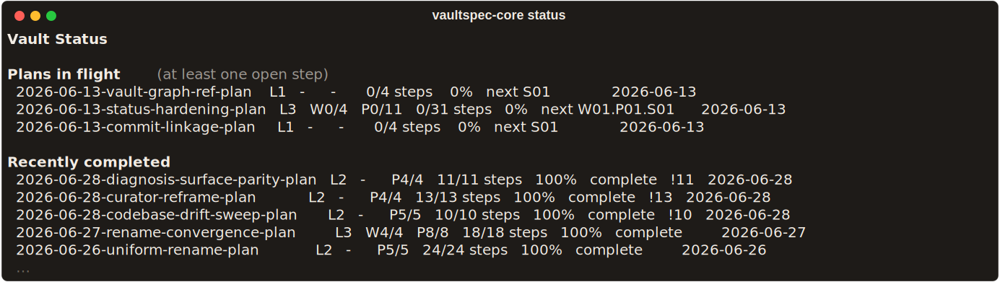
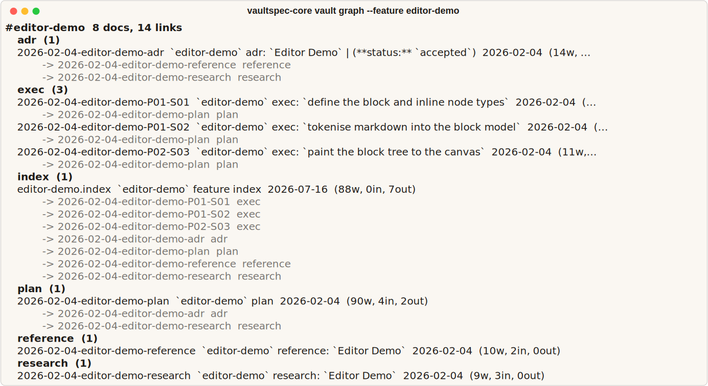
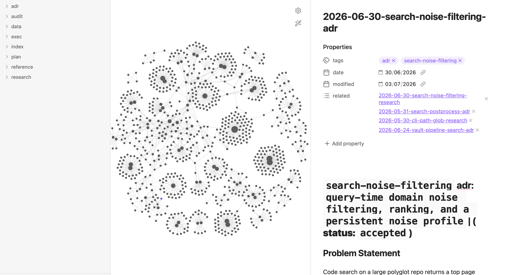
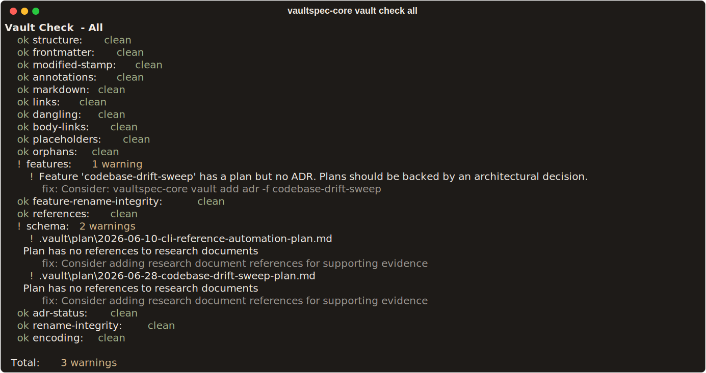
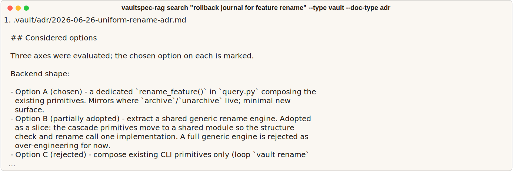

<div align="center">


# vaultspec-core

**The governed development harness for coding agents and the humans who review their
work.**

[](https://github.com/nevenincs/vaultspec-core/actions/workflows/ci.yml)
[](https://pypi.org/project/vaultspec-core/)
[](https://www.python.org/downloads/)
[](./LICENSE)

[](./docs/CLI.md)
[](./docs/MCP.md)

[Get started](#getting-started) · [Product](#the-pipeline-at-a-glance) ·
[Documentation](#learn-more) · [Family](#the-vaultspec-family) ·
[Support](#status-help-and-license)

</div>

<p align="center">

</p>

Vaultspec guides agents through a `Research → Decide (ADRs) → Plan → Execute → Verify`
pipeline, similar in spirit to spec-driven frameworks like Superpowers - with one
difference: nothing is throwaway. All work leaves a papertrail in the project's
`.vault`. Documents are bound together by feature tags and wiki-link references.
Together, they represent the project's decision and execution history - a second brain
your agents read before they write.

We hold ourselves to it, too: vaultspec-core is developed with vaultspec. Its own
`.vault` currently holds 900+ CLI-scaffolded documents across 100+ features, and every
terminal render on this page is real output - the stills against that live vault, the
demo above against a scratch project:

<p align="center">

</p>

## What is included?

`vaultspec-core` implements the natural language description of the workflow, and the
machinery that enforces it:

- **Rules, skills, and agent personas** for Claude, Codex, Gemini, and Antigravity,
  seeded from one `.vaultspec` source of truth and synced per provider.
- **A CLI** that scaffolds, audits, and repairs every vault document - templates, tag
  taxonomy, wiki-link resolution, and plan structure are enforced, never hand-written.
- **Structured plans** that scale with the work: four complexity tiers (`L1`-`L4`) with
  waves, phases, and steps under stable canonical identifiers.
- **An MCP server** for Model Context Protocol clients.

See the [framework manual](./docs/framework.md) for the full tour.

> [!TIP]
> The framework favours semantic search via the core's optional sister project,
> [vaultspec-rag](https://github.com/nevenincs/vaultspec-rag).

## Getting started

### 1. Install

For the quickest, dependency-free project bootstrap, run from a git project folder:

```bash
uvx vaultspec-core install
```

Use it as a tool or dependency:

```bash
# You can add it as a local tool
uv tool install vaultspec-core

# Or a project dependency
uv add vaultspec-core
```

### 2. Bootstrap

If you added it as a project dependency, bootstrap from inside your environment:

```bash
uv run --no-sync vaultspec-core install
```

See the [CLI reference](./docs/CLI.md) for installation options.

> [!NOTE]
> `vaultspec-core install` handles project integration separately: it manages a block in
> your `.gitignore` and `.gitattributes`, writes pre-commit hooks, and drops an
> `.mcp.json` for Model Context Protocol clients by default.

Install picks a mode for how the pre-commit hooks and the MCP server launch. Tool mode
is the default and runs vaultspec-core through `uvx`, so it never enters your project's
dependency set; dependency mode runs it through `uv run` and is selected automatically
when your `pyproject.toml` lists vaultspec-core. Pin either with `install --mode tool`
or `install --mode dependency`. An existing workspace has its mode inferred and recorded
the next time you run `install --upgrade`.

### 3. Sync

All development paper trails live in `.vault` as markdown files. Rules, agents, and
skills are seeded from `.vaultspec` via:

```bash
uv run --no-sync vaultspec-core sync
```

> [!TIP]
> Make sure to run
>
> ```bash
> uv run --no-sync vaultspec-core install --upgrade
> ```
>
> after a library update as the shipped agents, skills and rules might change between
> library versions.

## The pipeline at a glance

The pipeline breaks down into these steps:
`[R] Research  →  [D] Decide (ADRs)  →  [P] Plan  →  [E] Execute  →  [V] Verify`.
Research has a parallel entry point - Reference (`/vaultspec-code-research`) - that
grounds the work in existing source code; a feature starts from either, or both. Each
step ships with its skills, agents and CLI verbs.

To start using the framework describe the work you want done in natural language:

> "Start a new vaultspec pipeline to research options for adding full-text search to the
> API."

The synced rules guide the agent through the pipeline stage by stage, writing documents
into `.vault/` as it goes: a research note, then a decision record, a plan, execution
records, and a final review. You approve each checkpoint before the agent moves on.

Invoke a stage skill directly - for example `/vaultspec-research` - to enter the
pipeline at a specific stage. See the [framework manual](./docs/framework.md) for how
each one works.

### Skills

Skills are the slash-commands that drive each stage of the pipeline. Six map to the
pipeline stages; two helpers - curate and documentation - cover everyday upkeep. The
[framework manual](./docs/framework.md) gives full guidance on each, plus two further
skills for team coordination and project management.

**Which skill, when**

| When you want to                              | Skill                      |
| :-------------------------------------------- | :------------------------- |
| Explore a problem and weigh options           | `/vaultspec-research`      |
| Ground the work in the existing codebase      | `/vaultspec-code-research` |
| Record the decision and its consequences      | `/vaultspec-adr`           |
| Turn the decision into an implementation plan | `/vaultspec-write`         |
| Work through the plan, step by step           | `/vaultspec-execute`       |
| Audit the finished work by severity           | `/vaultspec-code-review`   |
| Repair vault links, frontmatter, and naming   | `/vaultspec-curate`        |
| Draft user-facing documentation               | `/vaultspec-documentation` |

## Every feature leaves a paper trail

One feature tag binds a feature's whole lifecycle - research, decision, plan, execution
records, and audit - into a linked graph the CLI can trace, validate, and visualize:

<p align="center">

</p>

Documents are scaffolded and structurally maintained through the `vaultspec-core vault`
command group - frontmatter, filenames, and plan structure are never hand-written, while
the body prose stays yours to edit. The CLI enforces templates, tag taxonomy, and
wiki-link resolution so your vault stays consistent.

```bash
# Scaffold a document from a template
vaultspec-core vault add research --feature search-api

# Find and inspect documents
vaultspec-core vault list --feature search-api

# Validate frontmatter, links, and cross-references (--fix to auto-repair)
vaultspec-core vault check all --fix

# Visualize a feature's dependency graph
vaultspec-core vault graph --feature search-api
```

Plans carry deeper structure - waves, phases, and steps. The
[framework manual](./docs/framework.md) covers that structure.

### The vault, rendered in Obsidian

The vault is plain Markdown with wiki-links, so it opens directly in
[Obsidian](https://obsidian.md): point a vault at `.vault/` and the feature tags and
document links render as a navigable graph network, while every document's frontmatter -
tags, dates, and `related:` wiki-links - shows up as first-class properties.

<p align="center">

</p>

A vaultspec project's vault in Obsidian: the whole document corpus as a graph, and an
accepted ADR open beside it with its tags and related records one click away.

## A vault that audits itself

Structure only helps if it holds. `vaultspec-core vault check` runs a battery of
validators over the corpus - frontmatter, tags, links, dangling references, leftover
placeholders, plan schema, encoding - and every finding ships with a fix hint, with
`--fix` applying the safe ones automatically:

<p align="center">

</p>

## Ask your history questions

A vault is only as useful as its recall. The optional sister project
[vaultspec-rag](https://github.com/nevenincs/vaultspec-rag) indexes both the vault and
the codebase for hybrid semantic search, so agents (and you) can ask *why* something was
decided and get the decision record back:

<p align="center">

</p>

## MCP server

vaultspec-core ships a Model Context Protocol server, and `vaultspec-core install` drops
its `.mcp.json` by default. Seven tools cover the everyday surface - `find`, `create`,
`edit`, `status`, `check`, `plan_progress`, `plan_edit` - and a `discover`/`invoke`
gateway reaches the rest of the CLI. Where the server is connected, the synced rules
treat it as the primary transport, falling back to CLI verbs for structural and sync
operations. The launch command in `.mcp.json` follows the install mode - `uvx` in tool
mode, `uv run` in dependency mode. See the [MCP reference](./docs/MCP.md) for setup and
the tool catalog.

## Learn more

| Guide                                   | What it covers                                              |
| --------------------------------------- | ----------------------------------------------------------- |
| [Framework manual](./docs/framework.md) | The development workflow, skills, agents, and customization |
| [CLI reference](./docs/CLI.md)          | Every command, flag, and option for vaultspec-core          |
| [MCP reference](./docs/MCP.md)          | The MCP server tools, setup, and configuration              |

## The vaultspec family

The family has three focused responsibilities: vaultspec-core governs the workflow and
vault; [vaultspec-rag](https://github.com/nevenincs/vaultspec-rag) retrieves decisions
and code by meaning; and
[vaultspec-dashboard](https://github.com/nevenincs/vaultspec-dashboard) is the visual
workspace that aggregates those views.

## Status, help, and license

vaultspec-core is actively developed. The version badge shows the current release. File
bugs and questions on the
[issue tracker](https://github.com/nevenincs/vaultspec-core/issues). Bug reports,
feature ideas, and pull requests are welcome. vaultspec-core is released under the
[MIT License](./LICENSE).
