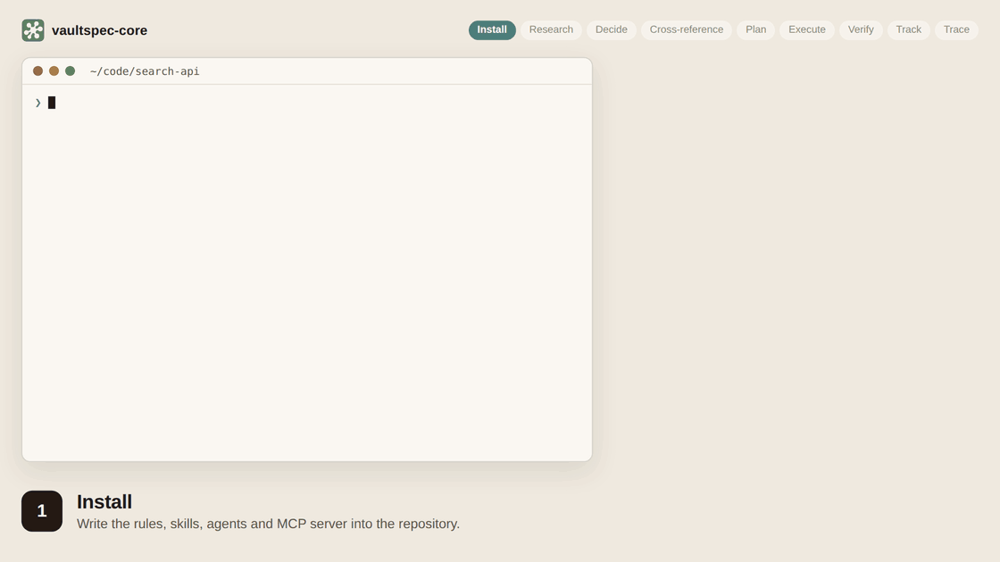
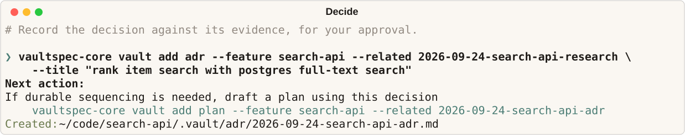
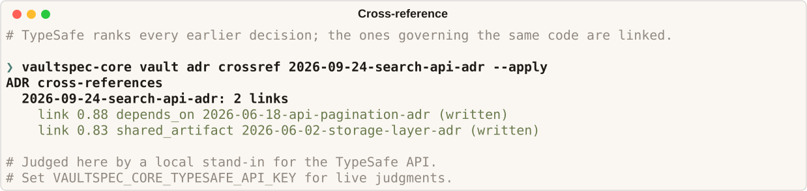
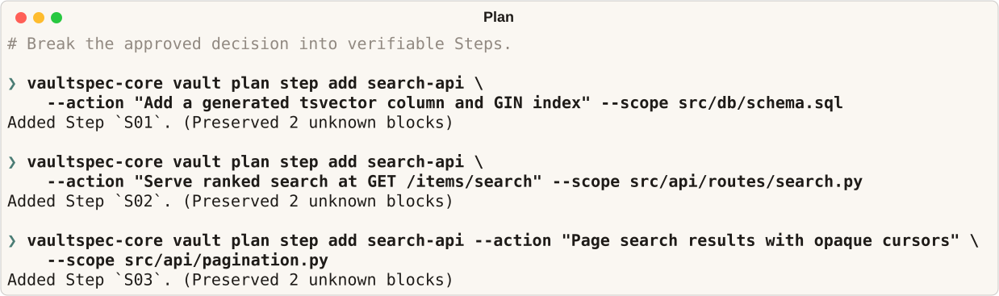
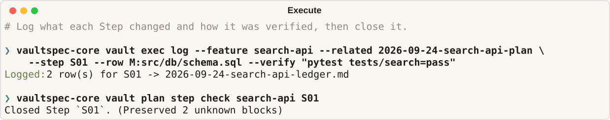
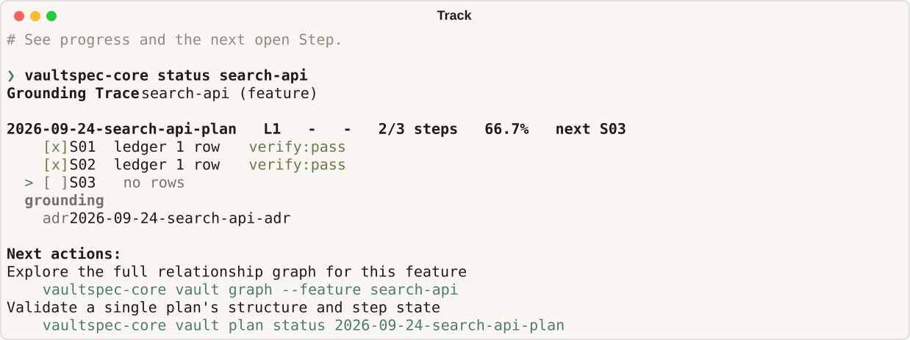
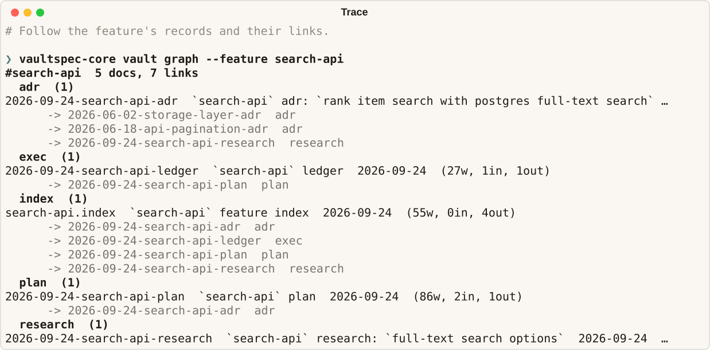
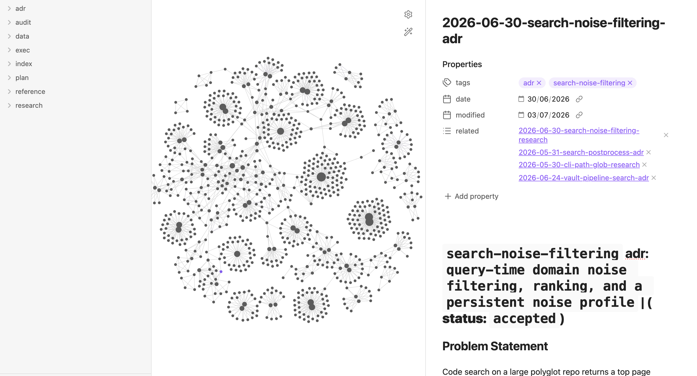

# vaultspec-core

Decision-driven harness for coding agents, and humans.

Vaultspec is a coding harness: it implements a structured coding workflow focused on
#features, decision records and the documents grounding them. It bundles rules, agents,
skills, and tools to author the documents that describe and track a feature's
development.

Your agent researches before it decides, records the decision before it builds, and logs
every Step it closes, as linked Markdown in your repository. The next session, the next
agent, or the next teammate picks up where the work stopped, and can see why it went the
way it did.

The harness supports Claude Code, Codex, Gemini CLI, and Antigravity.

[](https://github.com/nevenincs/vaultspec-core/actions/workflows/main-health.yml)
<picture><source media="(prefers-color-scheme: dark)" srcset="https://www.shieldcn.dev/github/release/nevenincs/vaultspec-core.svg?size=xs&amp;mode=dark&amp;font=roboto"></picture>
<picture><source media="(prefers-color-scheme: dark)" srcset="https://www.shieldcn.dev/github/license/nevenincs/vaultspec-core.svg?variant=ghost&amp;size=xs&amp;mode=dark&amp;font=roboto"></picture>
[](https://www.python.org/downloads/)

[Install](#install) · [Start a feature](#start-a-feature) ·
[See a feature built](#see-a-feature-built) · [TypeSafe](#rank-and-link-with-typesafe) ·
[Documentation](#documentation)

[](docs/assets/feature-cycle.mp4)

One feature, from research to a traced graph: real commands on the left, the record each
one produced on the right. [Watch the 45-second MP4](docs/assets/feature-cycle.mp4) for
full resolution.

## What you get

- **Decisions before code.** A costly-to-reverse choice gets an architecture decision
  record (ADR) grounded in research, and you approve it before implementation relies on
  it.
- **Plans that survive sessions.** Approved work becomes a plan of verifiable Steps. A
  ledger records what each Step changed and how it was checked, so any agent resumes
  from the next open Step.
- **One linked record.** Research, decisions, plans, and ledgers link to each other in
  `.vault/`. `vaultspec-core vault check all` keeps their structure and links sound.
- **Your agent, your repository.** Rules, skills, and agents install into each supported
  agent, with an MCP server for the tools. Everything is plain Markdown you commit and
  review.

## Install

Install [uv](https://docs.astral.sh/uv/getting-started/installation/), then run this
from your repository root:

```bash
uvx vaultspec-core install
```

Vaultspec supports Python 3.13 and 3.14. uv downloads a supported interpreter if needed.

The installer writes rules, skills, and agent configuration into your project and
configures a Model Context Protocol (MCP) server so your agent can call the tools.

Workflow documents live in `.vault/`; the policy lives in `.vaultspec/`. Commit both so
teammates share the records and rules. Installation also manages ignore rules for local
state and writes pre-commit configuration. Activating commit hooks is a
[separate choice](docs/framework.md#configure-project-integrations).

Keep the `uvx` prefix when running commands yourself. For persistent or project-local
installation, see [installation options](docs/framework.md#installation-options).
[Homebrew and Scoop](docs/channels.md) provide binaries that need no separate Python
install and no network: each one carries its own interpreter, Vaultspec and every
dependency.

## Start a feature

Open your repository in your coding agent and describe the work:

> Add full-text search to the API. Use the feature tag search-api. Check existing
> decisions first, and show me any new decision and implementation plan for approval.

The agent uses the parts of the workflow the task needs:

- Routine changes can proceed directly within your request.
- A costly-to-reverse choice needs evidence and an approved ADR. Reuse an existing
  accepted ADR when it already covers the work.
- Work that needs durable sequencing or handoff uses a plan, with or without a new ADR.
  The agent implements and verifies each Step, logs the changes, and reviews the
  integrated result.

Rules guide the agent's decisions; tools maintain document structure and progress.
Record checks complement tests and review, but do not prove the code is correct.
Approval covers the agreed scope, including ordinary in-scope corrections; new choices
outside that authorization need your input.

A feature tag groups the work's records. To see recorded progress:

```bash
uvx vaultspec-core status search-api
```

For planned work, ask the agent to resume the feature from its next open Step. The
[workflow guide](docs/framework.md#begin-a-pipeline) explains how to choose a route,
approve work, and continue across sessions.

## See a feature built

This is the `search-api` request above, built in a small repository that already records
three earlier decisions. Your agent runs these commands and writes the prose; you
approve the decision and the plan. Each image is the command's own output; the
cross-reference judgments come from a local stand-in for TypeSafe, as that image notes.

**1. Decide.** After a research record gathers the evidence, the agent scaffolds the
decision, linked to that research, and drafts it for your approval. Each scaffold names
the step that usually follows.



**2. Cross-reference.** [TypeSafe](#rank-and-link-with-typesafe) ranks every earlier
decision against the new one, and `--apply` links the ones that govern the same code.



**3. Plan.** The approved decision becomes a plan of verifiable Steps, each with the
files it touches.



**4. Execute.** For each Step, the agent logs the files it changed and the checks it ran
to the plan's ledger, then closes the Step.



**5. Track.** Once `vaultspec-core vault check all` passes, `status` shows what is done,
what each Step recorded, and where the next session starts.



**6. Trace.** The graph shows the feature's records and every link between them,
including the decisions it now references.



## Rank and link with TypeSafe

Vaultspec can use the [TypeSafe](https://docs.typesafe.ai) API to judge relevance where
keywords fall short. It is optional, and off until you set a key in the environment your
agent and its MCP server start from:

```bash
export VAULTSPEC_CORE_TYPESAFE_API_KEY=<your TypeSafe key>
```

With a key set, two commands rank by meaning:

- **Ask the vault.** `vaultspec-core vault search` (MCP: `search`) ranks the vault's
  records against a plain-language question and quotes the passage that answers it, with
  its line range. Type, feature, and date filters apply before anything is sent, and
  there is no index to build.
- **Connect decisions.** `vaultspec-core vault adr crossref` (MCP: `crossref`) finds the
  earlier ADRs a decision should link. It ranks every other ADR by the code and wording
  they share, has TypeSafe rank the strongest candidates, then has it judge the best
  pairs. `--apply` writes the new links into the ADR's `related:` field, which adds them
  to the vault graph. Each ADR costs at most 46 requests and 60 seconds, so the cost
  does not grow with the vault.

```bash
vaultspec-core vault search "why do pages use opaque cursors" --feature search-api
vaultspec-core vault adr crossref 2026-09-24-search-api-adr --apply
```

Every search and cross-reference sends vault text to the TypeSafe API; setting the key
is your consent to that. The key never appears in any output, and
`vaultspec-core status` shows whether one is configured and where it came from. A
project-local install can also read it from the workspace `.env`; see
[environment variables](docs/CLI.md#environment-variables).

Without a key nothing is sent, and everything else works. Both commands say that hosted
search is not configured and name what to run instead: a vaultspec-rag search when the
workspace provisions vaultspec-rag, otherwise `vaultspec-core vault list` and grep. See
the [search](docs/CLI.md#vaultspec-core-vault-search) and
[cross-reference](docs/CLI.md#vaultspec-core-vault-adr-crossref) references.

## Browse and search further

Open `.vault/` in [Obsidian](https://obsidian.md) to read the records and walk their
links. A mature vault looks like this:



The optional [vaultspec-rag](https://github.com/nevenincs/vaultspec-rag) package adds
local semantic search across the vault and your code. Code search is always its job;
hosted search covers the vault only.

## Documentation

- [Documentation index](docs/README.md): choose a guide for your task.
- [Framework manual](docs/framework.md): run the workflow and customize its rules.
- [Document syntax](docs/syntax.md): edit prose and manage document structure.
- [Verifying a workspace](docs/verification.md): check the setup and repair errors.
- [CLI reference](docs/CLI.md) and [MCP reference](docs/MCP.md): commands, tools, and
  configuration.

## Support and license

vaultspec-core is in beta. Report bugs, ask questions, or propose changes on the
[issue tracker](https://github.com/nevenincs/vaultspec-core/issues). For contributions
and releases, see [maintainer documentation](docs/README.md#for-maintainers).

Released under the [MIT License](LICENSE).
