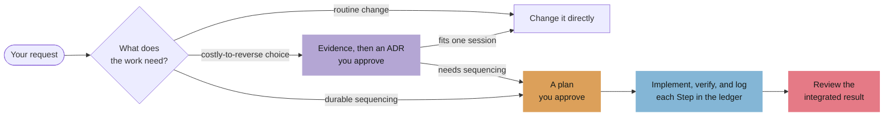

<div align="center">


# vaultspec-core: Decision-driven harness for coding agents, and humans

Vaultspec wraps your agent in a written workflow: research, decide, plan, execute, and
review. Each stage leaves a Markdown record in your repository's `.vault/` folder, and
the next session reads it first. Install it in an existing repository, and it records
work from then on. It's in beta.

[<picture><source media="(prefers-color-scheme: dark)" srcset="https://shieldcn.dev/github/ci/nevenincs/vaultspec-core.svg?workflow=main-health.yml&amp;branch=main&amp;label=ci&amp;variant=secondary&amp;size=xs&amp;mode=dark"></picture>](https://github.com/nevenincs/vaultspec-core/actions/workflows/main-health.yml)
[<picture><source media="(prefers-color-scheme: dark)" srcset="https://shieldcn.dev/pypi/v/vaultspec-core.svg?label=pypi&amp;variant=secondary&amp;size=xs&amp;mode=dark"></picture>](https://pypi.org/project/vaultspec-core/)
[<picture><source media="(prefers-color-scheme: dark)" srcset="https://shieldcn.dev/badge/python-3.13%20%7C%203.14.svg?logo=python&amp;variant=secondary&amp;size=xs&amp;mode=dark"></picture>](https://www.python.org/downloads/)
[<picture><source media="(prefers-color-scheme: dark)" srcset="https://shieldcn.dev/badge/cli%20%7C%20mcp.svg?variant=secondary&amp;size=xs&amp;mode=dark"></picture>](https://github.com/nevenincs/vaultspec-core#documentation)
[<picture><source media="(prefers-color-scheme: dark)" srcset="https://shieldcn.dev/github/license/nevenincs/vaultspec-core.svg?label=license&amp;variant=secondary&amp;size=xs&amp;mode=dark"></picture>](https://github.com/nevenincs/vaultspec-core/blob/main/LICENSE)

**[How it works](#how-it-works)** · **[Install](#install)** ·
**[Start a feature](#start-a-feature)** · **[Add-ons](#optional-add-ons)** ·
**[Commands](#everyday-commands)** · **[Documentation](#documentation)** ·
**[Support](#support-and-license)**

<br>


*The agent works through a command-line interface (CLI) that you can also run directly.
Here it takes one feature from install to a plan with its first Step logged.*

</div>

<br>
<br>

## How it works

Each feature, such as `search-api`, can move through a set of stages, and each stage
writes one record under `.vault/`.

| Stage     | What the record holds                                                                                   | Folder                          |
| --------- | ------------------------------------------------------------------------------------------------------- | ------------------------------- |
| Research  | Options weighed on evidence, each claim with a source, framing the choice without making it.            | `.vault/research/`              |
| Reference | How this or another codebase implements the thing, as patterns with `file:line` locators.               | `.vault/reference/`             |
| Decide    | An architecture decision record (ADR): one decision, its context, what it chose, and what it rules out. | `.vault/adr/`                   |
| Plan      | Approved work as numbered Steps, each one verifiable unit and one commit.                               | `.vault/plan/`                  |
| Execute   | An append-only ledger: one row per file each Step touched, plus the checks that ran.                    | `.vault/exec/<date>-<feature>/` |
| Review    | Findings against the plan and its decisions, one entry per finding with a severity.                     | `.vault/audit/`                 |

The agent starts with Reference for a question about existing code, or Research for an
open question. It skips both when the evidence already exists. An ADR starts `proposed`
and becomes `accepted` when you approve it. Critical or high review findings reopen the
affected Steps.

### Not every request runs every stage

The agent routes each request by what the work needs.


```mermaid
flowchart LR
    ask([Your request]) --> need{What does<br/>the work need?}
    need -- routine change --> direct[Change it directly]
    need -- costly-to-reverse choice --> adr[Evidence, then an ADR<br/>you approve]
    need -- durable sequencing --> plan[A plan<br/>you approve]
    adr -- fits one session --> direct
    adr -- needs sequencing --> plan
    plan --> steps[Implement, verify, and log<br/>each Step in the ledger]
    steps --> review[Review the<br/>integrated result]
    classDef decision fill:#b4a6d4,stroke:#b4a6d4,color:#141816
    classDef sequence fill:#dca05a,stroke:#dca05a,color:#141816
    classDef ledger fill:#84b6d6,stroke:#84b6d6,color:#141816
    classDef audit fill:#e57a86,stroke:#e57a86,color:#141816
    class adr decision
    class plan sequence
    class steps ledger
    class review audit
```

- **Routine changes** within settled decisions go straight to the code.
- **Costly-to-reverse choices** get an ADR. A choice is costly when reversing it needs
  coordinated migration, compatibility work, or material operational change. Boundaries,
  stored schemas, protocols, public interfaces, and dependency strategy are examples. If
  an accepted ADR already covers the work, the agent reuses it instead of writing a
  duplicate.
- **Durable sequencing** gets a plan when scope or progress must survive sessions or a
  handoff. If the current session can finish the work, the agent works directly, even
  after an ADR.

The agent applies the costly-to-reverse test, but you decide. Ask for a record it didn't
propose, or decline one it did.

No Step runs without approval. To get it, the agent shows you the record's path and a
short account of its scope and choices, then asks, and you answer in the chat. If you
approved that scope in advance, the agent records that approval instead of asking. Once
you approve, the agent marks the ADR `accepted`, or writes `Approved` and the date as
the first line of the plan's `## Description` section.

An approved plan covers its Steps and ordinary in-scope corrections. These come back to
you:

- A material scope change
- A new costly decision
- An action that needs new outside authority

The framework manual explains
[how to choose the route for your task](https://github.com/nevenincs/vaultspec-core/blob/main/docs/framework.md#choose-the-route-for-your-task).

### What the records look like

Here's the `.vault/` folder for a feature named `search-api` after research, an ADR, a
plan, one logged Step, and the feature index:

```text
.vault/
  adr/2026-09-29-search-api-adr.md
  exec/2026-09-29-search-api/2026-09-29-search-api-ledger.md
  index/search-api.index.md
  plan/2026-09-29-search-api-plan.md
  research/2026-09-29-search-api-research.md
```

An ADR opens with a metadata block, then a heading and fixed sections. The following
sample is shortened to two of its seven sections:

```markdown
---
tags:
  - '#adr'
  - '#search-api'
date: '2026-09-29'
modified: '2026-09-29'
body_schema: 'body-v2'
body_hash: 'sha256:2df51084e5c869329fd60edf7547f3e97ae4aa0fac7fac464259f1bb4c560ceb'
related:
  - "[[2026-09-29-search-api-research]]"
---

# `search-api` adr: `adopt postgres full-text search` | (**status:** `accepted`)

## Problem Statement

Search needs ranked results over document text without a separate search service.

## Rationale

Postgres already stores the documents, so full-text search adds no new infrastructure.
```

The CLI, the agent, and you split the work:

- The CLI names each file and writes its metadata. The metadata holds a type tag and a
  feature tag, dates, `related` links to the records this one builds on, and a body hash
  that exposes any unrecorded edit.
- You and the agent write the prose under the headings. Neither of you edits metadata or
  filenames by hand.
- Only the `vaultspec-core vault exec log` command writes the ledger. Agents reach the
  same command as the `log` tool of the Model Context Protocol (MCP) server.

The CLI also validates every record. See [Everyday commands](#everyday-commands).

### Why plain files

The records are ordinary Markdown in your repository. They're versioned with the code
and reviewed in the same pull request. Any editor, `grep`, or Obsidian opens them.

You don't need a database or hosted service to keep them. If you uninstall Vaultspec,
`.vault/` stays and the records remain readable. If you switch coding agents, nothing is
lost: the next agent reads the same files.

The price is discipline. The agent works through the stages the task needs, and the CLI
owns filenames and metadata. Validation flags a record that skips its template or links
to something that doesn't exist. That friction is deliberate: a record that validates is
one the next session can rely on.

The trade isn't always worth it. Routine changes already skip the records. For throwaway
or single-session work you don't expect to revisit, the records add little.

## Install

You need a Git repository, a supported coding agent (Claude Code, Codex, Gemini CLI, or
Antigravity), and [uv](https://docs.astral.sh/uv/getting-started/installation/). Then
run this from your repository root:

```bash
uvx vaultspec-core install
```

Vaultspec supports Python 3.13 and 3.14. uv downloads a supported interpreter if needed.

The installer writes rules, skills, and agent configuration into your project for all
four agents. To set up only one, pass its name, such as `claude`. For Claude Code,
Codex, and Antigravity, it also configures the MCP server so the agent can call
Vaultspec's tools. Gemini CLI calls them through the CLI. Installation doesn't start or
trust the server. If your agent asks, approve it.

Records live in `.vault/`, and the policy lives in `.vaultspec/`. Commit both, along
with the agent configuration the installer writes, so teammates share the records and
rules. Installation adds ignore rules that keep local state out of Git, such as lock
files, snapshots, and `.vaultspec/.env`. They also keep every `.env` and `.env.*` file
out of Git, at any depth; only `.env.example` templates stay committable. It also writes
a pre-commit configuration unless you pass `--skip precommit`. Activating the commit
hooks is a separate step; see
[configure project integrations](https://github.com/nevenincs/vaultspec-core/blob/main/docs/framework.md#configure-project-integrations).

To check the result, run:

```bash
uvx vaultspec-core doctor
```

It reports installation and record problems;
[checking a workspace](https://github.com/nevenincs/vaultspec-core/blob/main/docs/verification.md)
explains how to repair them. If you installed with uv, keep the `uvx` prefix when you
run commands. Commands named in running text omit it. For a persistent or project-local
installation, see
[installation options](https://github.com/nevenincs/vaultspec-core/blob/main/docs/framework.md#installation-options).

> [!TIP]
> If you'd rather not install uv,
> [Scoop and Homebrew](https://github.com/nevenincs/vaultspec-core/blob/main/docs/channels.md)
> provide binaries for Windows x86-64, Linux, and Apple silicon Macs. Each carries its
> own interpreter, Vaultspec, and every dependency, so a first launch runs offline. A
> binary puts `vaultspec-core` on your `PATH`, so run the commands in this README
> without the `uvx` prefix. On an Intel Mac, install with uv.

## Start a feature

Open your repository in your coding agent and describe the work:

> Add full-text search to the API. Use the feature tag search-api. Check existing
> decisions first, and show me any new decision and implementation plan for approval.

The agent checks the existing decisions, writes draft records under `.vault/`, and stops
in the chat to show you any new ADR and plan. Reply in the chat to approve them or to
say what should change. Once you approve, the agent implements the plan one Step at a
time. [How it works](#how-it-works) explains which route a request takes and what your
approval covers.

To see recorded progress:

```bash
uvx vaultspec-core status search-api
```

Without a feature tag, `vaultspec-core status` lists every plan in progress and its next
open Step:

<p align="center">

</p>

In a later session, ask the agent to resume the feature from its next open Step. The
[framework manual](https://github.com/nevenincs/vaultspec-core/blob/main/docs/framework.md#choose-the-route-for-your-task)
explains how to choose a route, approve work, and continue across sessions.

## Optional add-ons

The `.vault/` folder is plain Markdown with wiki-links, so
[Obsidian](https://obsidian.md) opens it directly as a vault, Obsidian's name for a
folder of linked notes. In the graph view, each feature's records gather around its
index, and shared decisions bridge the clusters:

<p align="center">

</p>

The separate [vaultspec-rag](https://github.com/nevenincs/vaultspec-rag) package indexes
the records and your source code on your machine for search by meaning. Ask why
something was decided, and it returns the ADR. Its README covers installation.

<p align="center">

</p>

Hosted search and ranking come from TypeSafe, an external hosted service, and are
optional. Set `VAULTSPEC_CORE_TYPESAFE_API_KEY` in the environment, or import it by name
with `uvx vaultspec-core install --env VAULTSPEC_CORE_TYPESAFE_API_KEY` (add `--upgrade`
for an existing installation).
[Local provisioning](https://github.com/nevenincs/vaultspec-core/blob/main/docs/CLI.md#local-environment-provisioning)
lists every place the key can come from. The key enables:

- [`vaultspec-core vault search`](https://github.com/nevenincs/vaultspec-core/blob/main/docs/CLI.md#vaultspec-core-vault-search)
  (MCP: `search`): answers questions about the records with a supporting passage.
- [`vaultspec-core vault adr crossref`](https://github.com/nevenincs/vaultspec-core/blob/main/docs/CLI.md#vaultspec-core-vault-adr-crossref)
  (MCP: `crossref`): suggests related ADRs and flags possible conflicts for the author
  to reconcile.
- [`vaultspec-core project context`](https://github.com/nevenincs/vaultspec-core/blob/main/docs/CLI.md#vaultspec-core-project-context)
  and
  [`vaultspec-core review context`](https://github.com/nevenincs/vaultspec-core/blob/main/docs/CLI.md#vaultspec-core-review-context):
  rank work items for coordination, and evidence for a code review. Pass `--no-hosted`
  to skip the hosted request.

> [!IMPORTANT]
> These calls send the following data to the TypeSafe API:
>
> - Search: the question and the record text.
> - Cross-referencing: the ADR text.
> - Project context: the objective and up to twelve shortlisted work-item summaries.
> - Review context: the review objective, a bounded diff, and candidate passages.
>
> Without a key, they send nothing.

Without a key, search and cross-referencing point you to a fallback: a vaultspec-rag
vault search when the workspace provisions vaultspec-rag, otherwise
`vaultspec-core vault list`, plus `grep` for search. The workflow continues with that
evidence. Project and review context order their results by local signals and by word
overlap with the objective. Code search is always vaultspec-rag's job.

## Everyday commands

Your agent runs most commands itself. These are the ones you're likely to run yourself.
If you installed a binary, drop the `uvx` prefix, and upgrade through Scoop or Homebrew
before you run `vaultspec-core install --upgrade`.

| Command                                               | What it does                                                                                                                                                        |
| ----------------------------------------------------- | ------------------------------------------------------------------------------------------------------------------------------------------------------------------- |
| `uvx vaultspec-core@latest install --upgrade`         | Fetches the latest release and updates this project's bundled rules, skills, and agents, then runs pending migrations. Run it in each project after a new release.  |
| `uvx vaultspec-core doctor`                           | Diagnoses the setup and the records together. Exits 0 when healthy, 1 on warnings, and 2 on errors. It reports unfilled template placeholders in a draft as errors. |
| `uvx vaultspec-core status search-api`                | Shows one feature's plan, each Step's state and ledger row count, and the records the plan builds on. Without the feature, it lists every plan in progress.         |
| `uvx vaultspec-core vault check all --fix`            | Validates every record (structure, metadata, links, plan schema, placeholders, and encoding) and applies the safe fixes. Each remaining finding prints its fix.     |
| `uvx vaultspec-core vault graph --feature search-api` | Prints a feature's records as a tree grouped by type, with each record's link counts.                                                                               |
| `uvx vaultspec-core uninstall --force`                | Removes `.vaultspec/` and the agent configuration. Keeps your `.vault/` records unless you add `--remove-vault`. To preview, use `--dry-run` instead of `--force`.  |

Here's `vaultspec-core vault check all` passing every validator. Record checks
complement tests and review; they don't prove the code is correct.

<p align="center">

</p>

For every command, flag, and exit code, see the
[CLI reference](https://github.com/nevenincs/vaultspec-core/blob/main/docs/CLI.md).

## Documentation

| Guide                                                                                                    | Purpose                                              |
| -------------------------------------------------------------------------------------------------------- | ---------------------------------------------------- |
| [Documentation index](https://github.com/nevenincs/vaultspec-core/blob/main/docs/README.md)              | Not sure which guide you need? Start here.           |
| [Framework manual](https://github.com/nevenincs/vaultspec-core/blob/main/docs/framework.md)              | Run the workflow and customize its rules.            |
| [Document syntax](https://github.com/nevenincs/vaultspec-core/blob/main/docs/syntax.md)                  | Edit prose and manage document structure.            |
| [Checking a workspace](https://github.com/nevenincs/vaultspec-core/blob/main/docs/verification.md)       | Check the setup and repair errors.                   |
| [Reviewing an implementation](https://github.com/nevenincs/vaultspec-core/blob/main/docs/correctness.md) | Review a change against its scope and test evidence. |
| [CLI reference](https://github.com/nevenincs/vaultspec-core/blob/main/docs/CLI.md)                       | Look up commands, flags, and configuration.          |
| [MCP reference](https://github.com/nevenincs/vaultspec-core/blob/main/docs/MCP.md)                       | Set up the MCP server and look up its tools.         |

## Support and license

Vaultspec is in beta. Report bugs, ask questions, or propose changes on the
[issue tracker](https://github.com/nevenincs/vaultspec-core/issues). For development and
releases, see
[maintainer documentation](https://github.com/nevenincs/vaultspec-core/blob/main/docs/README.md#for-maintainers).

Released under the
[MIT License](https://github.com/nevenincs/vaultspec-core/blob/main/LICENSE).
